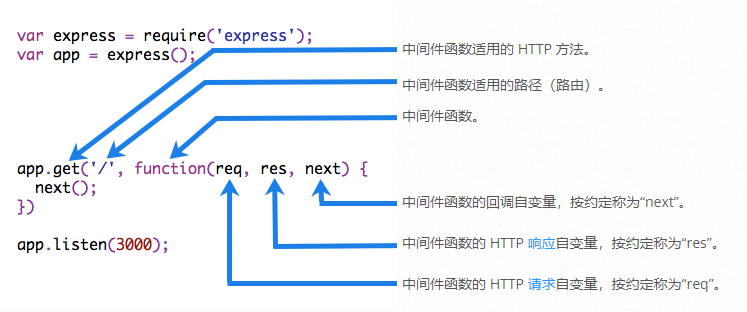

# 编写中间件

## 概述

中间件函数能够访问请求对象 (req)、响应对象 (res) 以及应用程序的请求-响应周期中的 `next`函数。`next` 是Express路由器中的一个函数，当调用该函数时，它将在当前中间件执行成功之后执行。

中间件功能可以执行以下任务:
  - 执行任何代码。
  - 对请求和响应对象进行更改。
  - 结束请求-响应周期。
  - 调用堆栈中的下一个中间件。

如果当前中间件函数没有结束请求-响应周期，必须调用 `next()` 来把控制权交给下个中间件函数。否则，请求将保持挂起状态。

下图展示了中间件调用的元素：



## 案例

下面是一个简单的“Hello World”Express应用程序示例。本章节的接下来部分将向应用程序定义并添加两个中间件函数：一个名为myLogger，它打印一个简单的日志消息；另一个名为requestTime，它显示HTTP请求的时间戳。

```javascript
var express = require('express')
var app = express()

app.get('/', function (req, res) {
  res.send('Hello World!')
})

app.listen(3000)
```

### 中间件函数 myLogger

下面是一个名为“myLogger”的中间件函数的简单示例。当应用程序的请求通过这个函数时，这个函数打印“log”。中间件函数被分配给一个名为myLogger的变量。

```javascript
var myLogger = function (req, res, next) {
  console.log('LOGGED')
  next()
}
```

> 请注意上面对next()的调用。调用 next() 将调用应用程序中的下一个中间件函数。next()函数不是Node.js或Express API的一部分。它只是传递给中间件函数的第三个参数。next()函数可以命名任何东西，但是按照惯例，它总是命名为“next”。为了避免混淆，请始终使用此约定。

使用 `app.use()` 装载这个中间件。例如，下面的代码在路由去往根路径(/)之间加载 myLogger中间件函数：

```javascript
var express = require('express')
var app = express()

var myLogger = function (req, res, next) {
  console.log('LOGGED')
  next()
}

app.use(myLogger)

app.get('/', function (req, res) {
  res.send('Hello World!')
})

app.get('/about', function (req, res) {
  res.send('about')
})

app.listen(3000)
```

应用程序每次收到请求时（不管是 '/' 还是 '/about'），都会在终端上显示消息“LOGGED”。

中间件装入顺序很重要：首先装入的中间件函数也首先被执行。

如果myLogger是在路由到根路径后加载的，那么请求永远不会到达它，应用程序也不会打印“logging”，因为根路径的路由处理程序终止了请求-响应周期。

中间件函数myLogger只是打印一条消息，然后通过调用next()函数将请求传递给堆栈中的下一个中间件函数。

### 中间件函数 requestTime

接下来，我们创建一个名叫 `requestTime` 的中间件函数，并且把它添加到请求对象的requestTime属性上。

```javascript
var requestTime = function (req, res, next) {
  req.requestTime = Date.now()
  next()
}
```

应用程序现在使用requestTime中间件功能。此外，根路径路由的回调函数使用中间件函数添加到req(请求对象)的属性。

```javascript
var express = require('express')
var app = express()

var requestTime = function (req, res, next) {
  req.requestTime = Date.now()
  next()
}

app.use(requestTime)

app.get('/', function (req, res) {
  var responseText = 'Hello World!<br>'
  responseText += '<small>Requested at: ' + req.requestTime + '</small>'
  res.send(responseText)
})

app.listen(3000)
```

当您向应用程序的根发出请求时，应用程序将在浏览器中显示请求的时间戳。

因为您拥有请求对象、响应对象、堆栈中的下一个中间件函数以及整个 Node.js API 的访问权，所以中间件函数的可能性是无穷的。

有关Express中间件的信息，请参阅[Using Express middleware](https://github.com/quxiaodong/express/blob/master/Guide/%E4%BD%BF%E7%94%A8%E4%B8%AD%E9%97%B4%E4%BB%B6.md)

## 配置中间件

如果您需要您的中间件是可配置的，那么导出一个函数，该函数接受options对象或其他参数，然后根据输入参数返回中间件实现。

创建my-middleware.js，并输入以下内容：

```javascript
module.exports = function(options) {
  return function(req, res, next) {
    // 根据传入的options执行不同的操作
    // if (options.option1 == 1) {
      // ...
    // }
    next()
  }
}
```

这个中间件可以像下面展示的一样使用：

```javascript
var mw = require('./my-middleware.js')

app.use(mw({ option1: '1', option2: '2' }))
```

有关可配置中间件的示例，请参阅[cookie-session](https://github.com/expressjs/cookie-session)和[compression](https://github.com/expressjs/compression)。